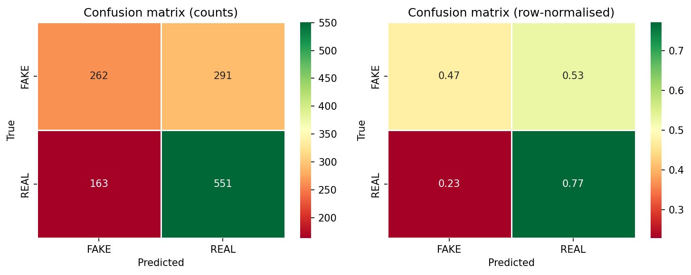
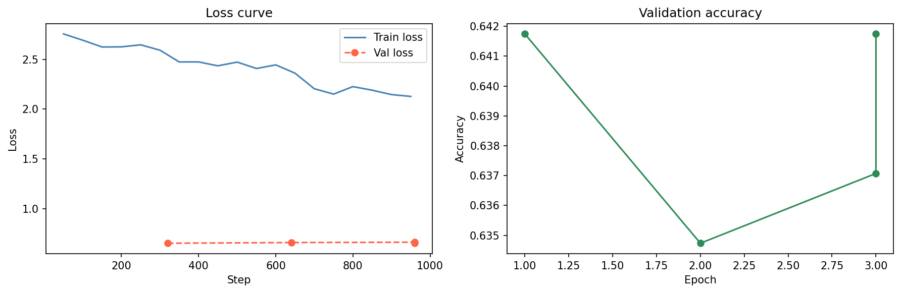

# FactTrace

FactTrace is an explainable fake news detection system that classifies news statements as **FAKE** or **REAL** using a fine-tuned DistilBERT transformer model.

The project combines transformer-based NLP classification with SHAP explainability to show which words influenced the model’s prediction.

## Overview

Fake news detection is not just about producing a prediction — it is also important to understand why the model made that prediction.

FactTrace takes a news statement as input, predicts whether it appears fake or real, shows the model confidence, and highlights the most influential words using SHAP word-level explanations.

This project demonstrates practical deep learning, NLP model fine-tuning, inference pipeline development, and explainable AI.

## Key Features

- Binary fake-vs-real news statement classification
- Fine-tuned DistilBERT transformer model
- Confidence score for each prediction
- SHAP-based word-level explanation
- Interactive Streamlit interface
- Random example generation for quick testing
- Clear limitation messaging for responsible interpretation

## Machine Learning Workflow

- Loaded and processed the LIAR benchmark dataset
- Converted text statements into tokenized transformer inputs
- Generated attention masks for DistilBERT
- Fine-tuned DistilBERT for binary text classification
- Saved the trained model and tokenizer locally
- Built an inference pipeline for real-time prediction
- Integrated SHAP to explain token-level model behavior

## Tech Stack

- Python
- PyTorch
- Hugging Face Transformers
- DistilBERT
- SHAP
- Streamlit
- Pandas
- NumPy
- Matplotlib
- Scikit-learn

## Screenshots

### Prediction Interface

### SHAP Word-Level Explanation

## Model Outputs

### Confusion Matrix

### Training Curves

